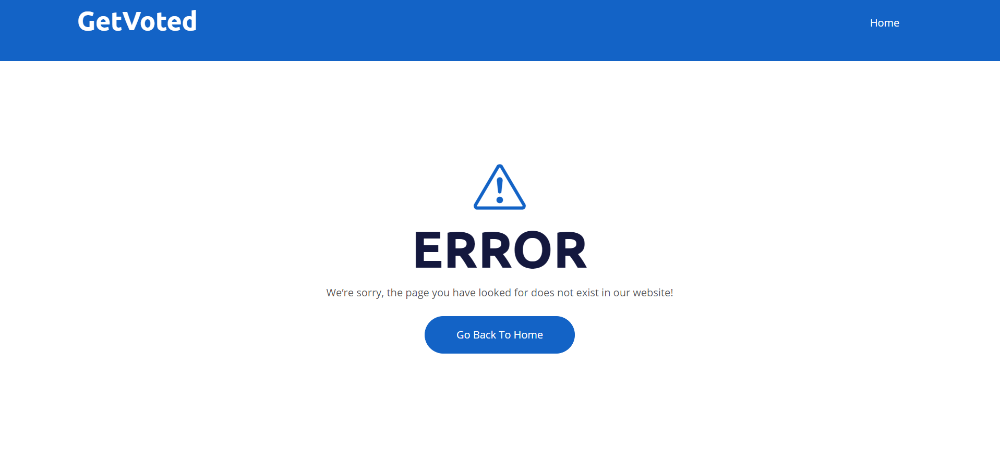

## GetVoted 
Our decentralized voting app seeks to fundamentally alter how elections and decision-making are carried out. The main goal is to offer a trustworthy, open, and uncorruptible platform for voting.

GetVoted is important essential in making sure that voting processes are fair and reliable, not only for political elections but also for corporate decision-making.

## Pages documentation

In index.html we have navigation bar and login

Here you can read about GetVoted and Decentralized Voting 

The adminpanel.html page is designed to add new polls. To add poll you need to fill in Topic, Number of Candidates, Start Date, End Date, Description of Poll, Image of Poll.

also we have  “Open voting” where you can see votings that happening right now

This is the final result page, here the user can see the results of the final votes

On this page we can see a 404 error. If the user goes to a non-existent page, it means that the requested information does not exist on the site. The page may have been deleted, moved, or the URL may have been entered incorrectly.
